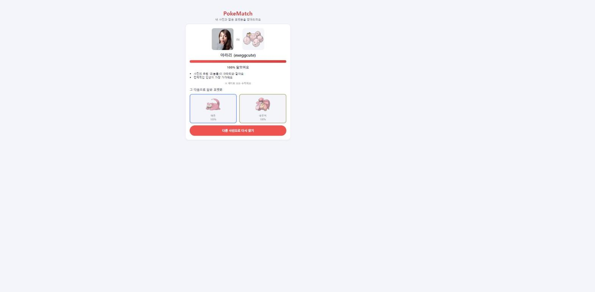

# PokeMatch: 닮은꼴 포켓몬 찾기

사진 1장을 올리면 딥러닝 모델(CLIP)로 가장 닮은 포켓몬 3마리와 그 이유를 보여주는 웹 서비스입니다. (1~5세대, 649마리)

> 🔗 배포 주소: [poke-match-alpha.vercel.app](https://poke-match-alpha.vercel.app)
>
> ⏳ **처음 접속하면 브라우저가 CLIP 모델(약 수십MB)을 내려받느라 시간이 좀 걸려요.**
> 진행률 바가 다 차고 나면 두 번째부터는 브라우저에 저장돼 있어서 훨씬 빨라집니다.



## 실행 방법

```bash
npm install              # 패키지 설치
npm run build-data       # 포켓몬 데이터 + CLIP 벡터 만들기 (data/pokemon.json)
npm start                # 로컬 서버 실행 → http://localhost:3000
```

`data/pokemon.json`은 이미 저장소에 포함되어 있으므로, 벡터를 새로 계산하고 싶을 때만
`npm run build-data`를 다시 실행하면 됩니다.

### Vercel로 배포하기

1. 이 프로젝트를 GitHub 저장소에 올린다 (공개 저장소 권장).
2. [vercel.com](https://vercel.com)에 GitHub 계정으로 가입/로그인한다.
3. **Add New → Project**에서 방금 올린 저장소를 선택하고 **Deploy**를 누른다.
   (`vercel.json`에 필요한 설정이 이미 들어있어서 따로 건드릴 항목이 없다)
4. 배포가 끝나면 나오는 `https://(이름).vercel.app` 주소로 접속해 확인한다.
5. 이후 코드를 고쳐서 GitHub에 push하면 Vercel이 자동으로 다시 배포한다.

## 구조

**1) 전체 동작 흐름** — 포켓몬 벡터는 미리 계산해 두고, 사진 벡터만 그때그때 브라우저에서 계산한다.

```
[내 컴퓨터에서 한 번 실행]  scripts/build-data.js
   PokéAPI ──▶ 이름·타입·색·그림 주소
   CLIP    ──▶ 그림 벡터, 설명글 벡터, 분위기, 판정용 문장 벡터
          ──▶ data/pokemon.json  (Git에 커밋, 배포 시 새로 안 만듦)

[서버: Express → Vercel 서버리스 함수]
   GET /api/pokemon, /api/pokemon/:id, /api/labels
   public/ 폴더는 Vercel이 정적 파일로 그대로 내보냄

[브라우저]
   1) CLIP 이미지 모델 불러오기 (처음 1번만, 이후 캐시)
   2) 사진 → 벡터 → 사람인지 확인
   3) 649마리와 점수 계산 → 상위 3마리 + 이유
```

**2) 폴더 구조**

```
public/       화면 파일 (index.html, style.css, app.js, matcher.js)
src/app.js    Express 앱 (app만 export, Vercel이 서버리스 함수로 실행)
src/local.js  로컬 실행 전용 (app.listen, public 정적 서빙)
scripts/      포켓몬 데이터 + CLIP 벡터를 만드는 스크립트
data/         build-data.js가 만든 결과물 (pokemon.json)
docs/         시험 기록(feedback.md), 스크린샷
```

**3) 점수 계산 흐름** (사진 1장 → 닮은 정도 %)

```
사진 벡터, 포켓몬 벡터 649개 전체
  └─▶ 센터링: 각 벡터에서 "649마리의 평균 방향"을 뺀다 (유명한 포켓몬으로 쏠리는 편향 완화)

센터링된 사진 벡터
  ├─ · 센터링된 설명글 벡터 → 설명 점수 (가중치 0.5)
  ├─ · 센터링된 그림 벡터   → 그림 점수 (가중치 0.4)
  └─ 사진 색 == 포켓몬 색?  → 색 점수   (가중치 0.1, 0 또는 1)
        └─▶ 최종 점수 = 0.5×설명 + 0.4×그림 + 0.1×색
              └─▶ (최종 점수 − 0) ÷ (0.25 − 0) × 100 = 닮은 정도(%)
```

## 동작 원리

- **CLIP**: 사진과 문장을 같은 512차원 공간의 벡터(숫자 목록)로 바꿔주는, 이미 학습이 끝난 모델. 이 프로젝트에서는 모델을 새로 학습시키지 않고 그대로 가져다 쓴다.
- **코사인 유사도**: 두 벡터의 방향이 얼마나 비슷한지 나타내는 값(-1~1, 1에 가까울수록 비슷함). 벡터 길이를 미리 1로 맞춰두면(정규화) 내적(같은 자리 숫자끼리 곱해서 더한 값)만으로 코사인 유사도를 구할 수 있다.
- **센터링**: 649마리 벡터의 평균을 구해서 모든 벡터에서 빼는 보정. 사진과 무관하게 "모든 포켓몬과 두루 비슷해 보이는 방향"을 지워서, 유명한 포켓몬(피카츄, 코일 등)으로 쏠리는 경향을 줄인다.
- **점수 공식**: 위 "점수 계산 흐름" 그림대로, 설명 점수·그림 점수·색 점수를 가중 합해서 최종 점수를 내고, 실제 값 분포(대략 0~0.25)에 맞춰 0~100% "닮은 정도"로 바꾼다.

## 기술 선택 이유

- **왜 브라우저에서 CLIP을 돌렸나**: 사진을 서버로 보내지 않고 기기 안에서만 처리하기 위해서(개인정보 보호). 서버로 사진을 보내지 않으니 이미지 처리 API 비용도 들지 않는다.
- **왜 포켓몬 벡터를 미리 계산해 두었나**: 649마리 벡터는 사진이 바뀌어도 항상 같은 값이라, 요청마다 다시 계산할 필요가 없다. 미리 계산해 `data/pokemon.json`에 저장해 두면 서버는 파일을 읽어서 내려주기만 하면 되고, 브라우저는 사진 1장 벡터만 계산하면 돼서 훨씬 빠르다.
- **왜 pipeline 대신 CLIPVisionModelWithProjection/CLIPTextModelWithProjection을 직접 썼나**: Transformers.js 버전이 올라가면서 pipeline 방식이 오류를 낸 적이 있어서, 더 안정적인 저수준 API를 직접 쓰고 버전을 고정했다.
- **왜 색 판정을 CLIP이 아니라 canvas 픽셀로 직접 세었나**: 색은 눈으로 봐도 맞는지 바로 확인할 수 있는 간단한 정보라, 딥러닝 없이 canvas로 픽셀을 세는 방식이 더 빠르고 이해하기 쉽다.

## 겪은 문제와 해결

1. **`<script src="app.js">`에 `type="module"`을 빠뜨림** — 3단계에서 화면을 새로 짤 때 import문이 있는데 `type="module"`을 안 붙여서 `SyntaxError: Cannot use import statement outside a module`이 났다. 속성을 추가해서 해결.
2. **`hidden` 속성이 안 먹힘** — `.card { display: flex }`처럼 클래스 스타일을 주면, 브라우저 기본 스타일인 `[hidden] { display: none }`과 명시도(specificity)가 같아서 작성 순서상 우리 스타일이 이겨버려 화면 3개가 동시에 보이는 버그가 있었다. `[hidden] { display: none !important; }` 규칙을 추가해서 해결.
3. **배포용 함수에 불필요한 무거운 패키지가 딸려갈 뻔함** — `@huggingface/transformers`가 `package.json`의 `dependencies`에 있었는데, 실제로는 로컬 스크립트(`build-data.js`)에서만 쓰고 배포되는 `src/app.js`는 쓰지 않는다. `devDependencies`로 옮겨서 배포 함수 용량을 줄였다.
4. **`vercel.json`을 직접 쓰면 `public/` 폴더가 자동으로 안 내려감** — `builds` 배열에 `src/app.js`만 지정하고 배포했더니 `/`와 `/index.html`이 404가 났다. `@vercel/static` 빌드와 라우트를 추가해서 해결.
5. **5세대까지 늘렸더니 유명한 포켓몬(피카츄, 코일)으로 자주 쏠림** — 실제로는 다른 세대도 근소한 차이로 후보에 있었지만, 동점에 가까운 상황에서 유명한 포켓몬이 계속 이겼다. CLIP이 유명한 대상을 더 잘 아는 데서 오는 편향으로 보고, 649마리 벡터의 평균을 빼는 "센터링" 보정을 추가해서 완화했다.

## 개선 기록 (4단계, 그리고 5세대 확장 후 추가 보정)

시험 사진 10장으로 문제를 찾고 수치를 조정한 전체 과정은 [`docs/feedback.md`](docs/feedback.md)에 있다. 요약하면:

| 무엇을 | 원래 값 → 새 값 | 효과 |
|---|---|---|
| `SIMILARITY_MIN`/`MAX` (닮은 정도 계산 기준) | 0.15~0.35 → 0.2~0.42 | 거의 항상 100%로 뭉치던 결과가 실제 값 분포에 맞게 퍼짐 |
| 색 판정 범위 (사진 가운데 몇 %를 볼지) | 60% → 35% | 인물 사진 뒤 배경(특히 회색 스튜디오 배경) 영향을 줄임 |
| 벡터 센터링 (649마리로 늘린 뒤 추가) | 없음 → 평균 방향 빼기 적용 | 유명한 포켓몬(피카츄, 코일 등)으로 쏠리던 동점 상황이 줄고 결과가 더 다양해짐 |

**납득할 만한 결과(○) 개수: 10장 중 0개 → 6개로 개선.**

## 한계

- CLIP은 실제 사진과 포켓몬 그림(카툰 스타일)을 비교하기 때문에, 사진 배경이나 옷 색처럼 "닮음"과 상관없는 요소에 영향을 받을 때가 있다. 특히 단순한 형태 + 밝은 배경의 사진은 그림이 단순한 포켓몬(코일 등)으로 쏠리는 경향이 남아있다.
- AI 언어 모델처럼 "왜 닮았는지" 문장으로 설명하지 못한다. 이유는 색·분위기 같은 계산 결과로만 보여준다.
- 1~5세대 포켓몬 649마리 안에서만 찾으므로, 6세대 이후 포켓몬은 후보에 없다.

## 배운 점

- 미리 학습된 모델을 "그대로 가져다 쓰는 것"(추론)과 "새로 학습시키는 것"의 차이, 그리고 제로샷 분류로 사람/분위기/색을 판정하는 방법을 배웠다.
- 벡터·정규화·내적·코사인 유사도가 실제로는 "숫자 목록 두 개가 얼마나 같은 방향을 보는가"라는 간단한 개념이라는 걸 코드로 직접 짜보며 이해했다.
- 브라우저와 서버, 로컬 실행과 서버리스 배포처럼 "어디서 무엇을 계산하고 저장할지" 나누는 설계가 성능과 개인정보 보호에 직접 영향을 준다는 걸 체감했다.
- 숫자(가중치, 기준값)를 감으로 정하지 않고, 실제 사진으로 시험해서 분포를 보고 조정하는 과정이 왜 필요한지 배웠다.

## 기술 스택

HTML·CSS·순수 자바스크립트, Node.js + Express, Transformers.js(CLIP), PokéAPI, Vercel Hobby
